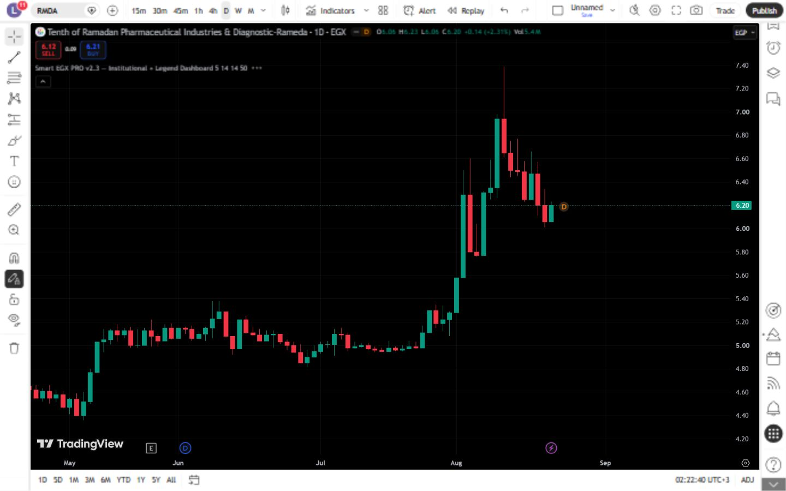
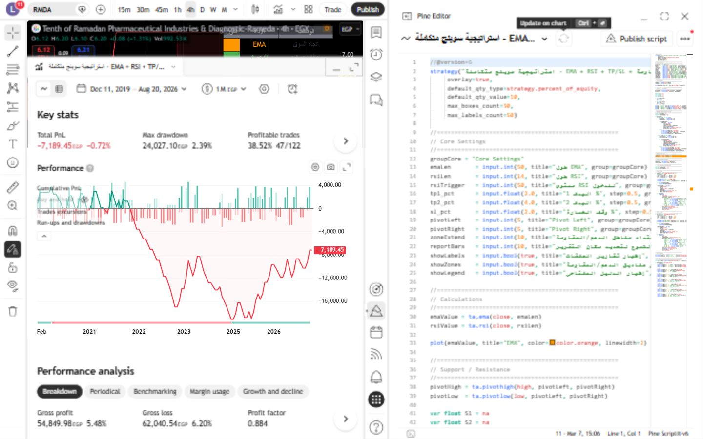

# EGX Pine Script Indicators & Strategies

Verified TradingView research tools for the Egyptian Exchange (EGX), built with Pine Script and documented with chart evidence, strategy reports, and reproducible test notes.

> **Current validation:** 120 exported scripts tested on TradingView · **120 passed** after repairing and re-testing the five original compile failures on 2026-08-22.

## What this repository demonstrates

- Pine Script v5/v6 indicator and strategy engineering.
- EGX-oriented trend, momentum, liquidity, pivot, smart-money, trap, and risk dashboards.
- Real TradingView compile and visual checks with a report beside each tested script.
- Honest backtest documentation, including both positive and negative outcomes.
- Repainting-aware design: confirmed pivots, prior-period data, and explicit live-bar caveats.

## Verification evidence

The complete test export is under [`tradingview-export/2026-08-21`](tradingview-export/2026-08-21/README.md). Each tested script has a neighboring `.tests` directory containing its TradingView screenshot and test report.

| Evidence | Result |
|---|---|
| Exported Pine scripts tested | 120 |
| Passed after the repair and re-test | 120 |
| Original compile failures repaired | 5 |
| Chart and report screenshots | 127 |
| Test documentation files | 120+ |

## Selected case studies

- [Ultimate Scalping Pro v2.6 — positive backtest with limitations](docs/case-studies/ultimate-scalping-pro-v2-6.md)
- [Integrated Swing Strategy — negative backtest and lessons learned](docs/case-studies/integrated-swing-strategy.md)
- [Reusable case-study template](docs/case-studies/CASE-STUDY-TEMPLATE.md)

## Toolkit map

| Need | Representative tools |
|---|---|
| Trend and market regime | Smart EGX Trend Engine, AboSamra Pro |
| Momentum and corrections | Smart Correction Signals Pro |
| Liquidity and smart money | Smart EGX Liquidity S/R Dashboard, Smart Money Core |
| Trap detection | MM Trap Pro |
| Pivot and price matrices | EGX Pro Price Matrix, EGX Pro Matrix MTF Filter |
| Risk sizing | EGX Pro Matrix Risk Manager |
| Multi-module dashboards | Expert EGX Analyst Pro, EGX Smart Balance Matrix Pro |
| Strategy research | EMA/RSI TP-SL, Ultimate Scalping, Integrated Swing |

Browse the curated scripts in [`indicators`](indicators), [`strategies`](strategies), and the [script index](docs/scripts-index.md). Historical and incomplete work is isolated under [`archive`](archive).

## Engineering principles

- Confirm historical signals before presenting them as stable.
- Use `barmerge.lookahead_off` for cleaned higher-timeframe logic.
- Reuse labels, tables, boxes, and arrays to avoid chart-object exhaustion.
- Separate compile/visual validation from profitability claims.
- Document symbol, timeframe, date, settings, and limitations beside every result.
- Treat all tools as research software, never as guaranteed signals.

## AI-assisted roadmap

The current Pine layer is rule-based. Planned AI work is limited to explainability and reporting: structured signal export, Python validation, automated summaries, and human-readable technical-analysis reports. See the [AI roadmap](docs/AI-ROADMAP.md).

## Related repositories

- [Curated five-indicator portfolio](https://github.com/Alaamo7/pine-script-portfolio)
- [Arabic-friendly Pine Script v6 course](https://github.com/Alaamo7/pine-script-v6-course)

## License and risk notice

Source is published for portfolio viewing and education. Redistribution, resale, modification, or commercial use requires written permission; see [LICENSE](LICENSE). Nothing here is financial advice, and a successful compile or historical backtest does not predict future performance. See the full [disclaimer](docs/DISCLAIMER.md).

## Author

Developed and maintained by **Alaa Hamza** — Pine Script and TradingView developer focused on EGX technical-analysis tooling.
