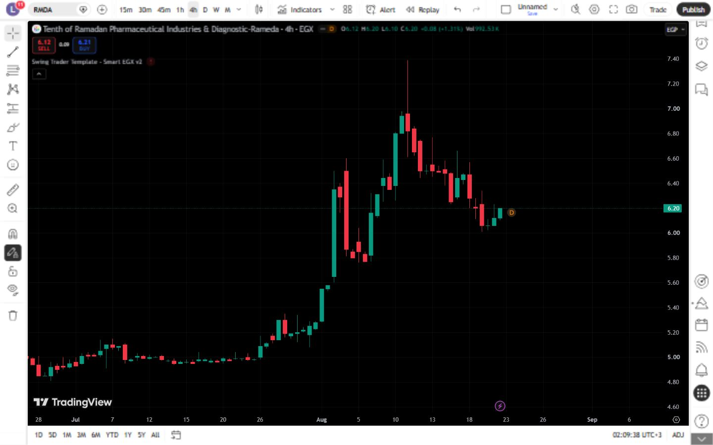

# تقرير اختبار TradingView — Swing Trader Template - Smart EGX v2

- **المعرّف:** 043
- **النوع:** Indicator
- **Pine Script:** v5
- **ملف المصدر:** `tradingview-export/2026-08-21/indicators/043-swing-trader-template-smart-egx-v2.pine`
- **الرمز المختبر:** EGX:RMDA
- **الإطار الزمني:** 4 hours
- **وقت توثيق النتيجة:** 2026-08-21 23:09:40 UTC

## النتيجة

✅ تم التحميل والعرض بنجاح

### رسائل Pine Editor

- `Arguments of input function must be of constant type, or 'source' builtin variables.`

## منهجية الاختبار

1. أُزيل المؤشر الافتراضي وأي سكربت سابق من الرسم قبل بدء الاختبار.
2. فُتح السكربت المحفوظ باسمه الأصلي داخل Pine Editor.
3. أُضيف السكربت منفرداً إلى رسم EGX:RMDA على الإطار الزمني الموضّح أعلاه.
4. سُجّلت رسائل Pine Editor، ثم التُقطت صورة الرسم.
6. أُزيل السكربت من الرسم قبل الانتقال إلى الاختبار التالي.

## الصور

## ملاحظات

- النتيجة توثّق حالة السكربت وإعداداته وبيانات TradingView وقت الاختبار، وليست ضماناً للأداء المستقبلي.
- نتائج الاستراتيجية التاريخية لا تشمل بالضرورة الانزلاق السعري أو السيولة الفعلية أو كل تكاليف التنفيذ.
- لا يُنصح بالاعتماد على أي سكربت ذي خطأ Pine قبل إصلاحه وإعادة اختباره.
