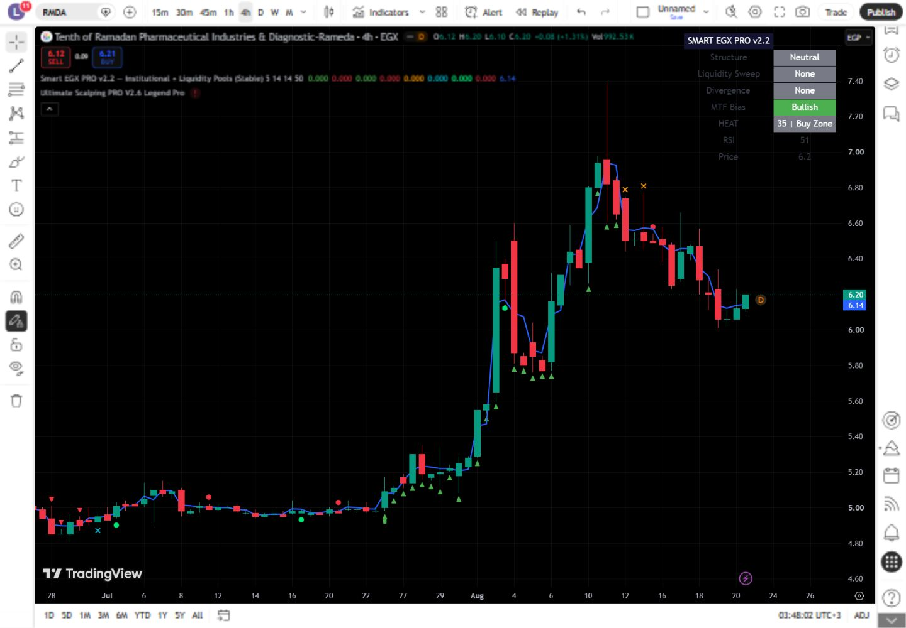

# تقرير اختبار TradingView — Swing Trader Template - Smart EGX v2 2

- **المعرّف:** 045
- **النوع:** Indicator
- **Pine Script:** v6
- **ملف المصدر:** `tradingview-export/2026-08-21/indicators/045-swing-trader-template-smart-egx-v2-2.pine`
- **الرمز المختبر:** EGX:RMDA
- **الإطار الزمني:** 4 hours
- **وقت إعادة الاختبار:** 2026-08-22 (Africa/Cairo)

## النتيجة

✅ تم التجميع والتحميل والعرض بنجاح بعد الإصلاح

### الإصلاح المطبق

- ترقية المصدر إلى Pine v6، وتصحيح نص الدليل، وإعادة استخدام `label` واحد على آخر شمعة.
- لا توجد أخطاء تجميع متبقية في إعادة الاختبار.

## منهجية الاختبار

1. نُسخ ملف المصدر المصحح نفسه من المستودع إلى Pine Editor.
2. حُفظ كنسخة اختبار خاصة، ثم جرى تجميعه وتحديثه على رسم EGX:RMDA.
3. تأكد ظهور Pine v6 وعدم وجود رسالة خطأ تجميع.
4. التُقطت صورة الرسم بعد نجاح التحديث.
5. جرى استبدال كود نسخة الاختبار الخاصة بالملف التالي دون نشر أي سكربت للعامة.

## الصور

## ملاحظات

- النتيجة توثّق حالة السكربت وإعداداته وبيانات TradingView وقت الاختبار، وليست ضماناً للأداء المستقبلي.
- نتائج الاستراتيجية التاريخية لا تشمل بالضرورة الانزلاق السعري أو السيولة الفعلية أو كل تكاليف التنفيذ.
- الصورة الحالية توثّق نسخة المصدر المصححة التي جرى تجميعها على Pine v6.
