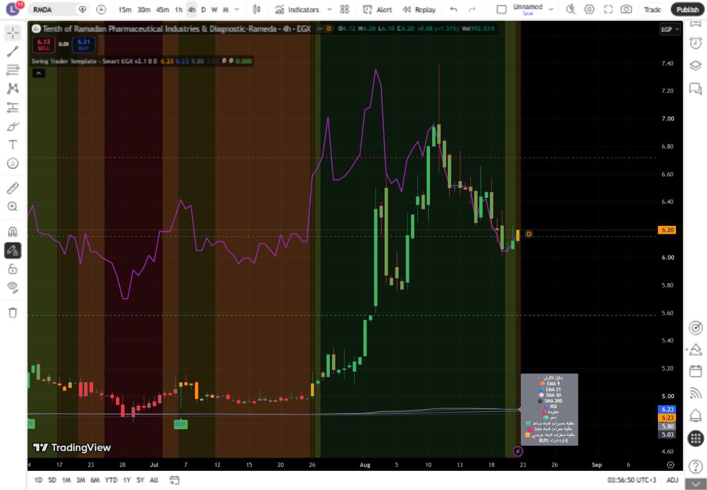

# تقرير اختبار TradingView — Swing Trader Template - Smart EGX v2.1 1

- **المعرّف:** 049
- **النوع:** Indicator
- **Pine Script:** v6
- **ملف المصدر:** `tradingview-export/2026-08-21/indicators/049-swing-trader-template-smart-egx-v2-1-1.pine`
- **الرمز المختبر:** EGX:RMDA
- **الإطار الزمني:** 4 hours
- **وقت إعادة الاختبار:** 2026-08-22 (Africa/Cairo)

## النتيجة

✅ تم التجميع والتحميل والعرض بنجاح بعد الإصلاح

### الإصلاح المطبق

- ترقية المصدر إلى Pine v6، وتصحيح نص الدليل، وإعادة استخدام `label` واحد على آخر شمعة.
- لا توجد أخطاء تجميع متبقية في إعادة الاختبار.

## منهجية الاختبار

1. أُزيل المؤشر الافتراضي وأي نسخة اختبار سابقة من الرسم.
2. نُسخ ملف المصدر المصحح نفسه من المستودع إلى Pine Editor مع الحفاظ على فواصل الأسطر.
3. حُفظ كنسخة اختبار خاصة، ثم جرى تجميعه وتحديثه منفردًا على رسم EGX:RMDA.
4. تأكد ظهور Pine v6 وعدم وجود رمز أو رسالة خطأ تجميع.
5. التُقطت صورة الرسم المعزولة بعد نجاح التحديث.
6. جرى استبدال كود نسخة الاختبار الخاصة بالملف التالي دون نشر أي سكربت للعامة.

## الصور

## ملاحظات

- النتيجة توثّق حالة السكربت وإعداداته وبيانات TradingView وقت الاختبار، وليست ضماناً للأداء المستقبلي.
- نتائج الاستراتيجية التاريخية لا تشمل بالضرورة الانزلاق السعري أو السيولة الفعلية أو كل تكاليف التنفيذ.
- الصورة الحالية توثّق نسخة المصدر المصححة التي جرى تجميعها على Pine v6.
