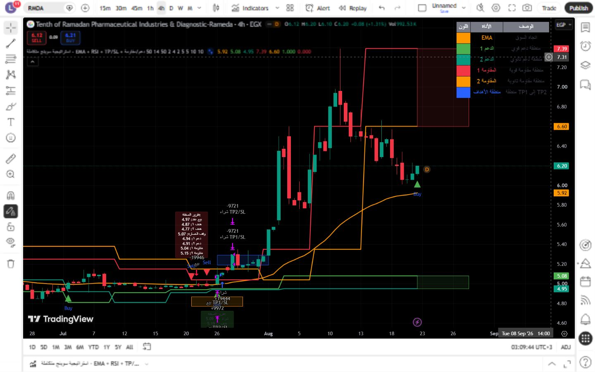

# تقرير اختبار TradingView — استراتيجية سوينج متكاملة - EMA + RSI + TP/SL + دعم/مقاومة

- **المعرّف:** 099
- **النوع:** Strategy
- **Pine Script:** v6
- **ملف المصدر:** `tradingview-export/2026-08-21/strategies/099-ema-rsi-tp-sl.pine`
- **الرمز المختبر:** EGX:RMDA
- **الإطار الزمني:** 4 hours
- **وقت توثيق النتيجة:** 2026-08-22 00:09:49 UTC

## النتيجة

✅ تم التحميل والعرض بنجاح

## ملخص Strategy Tester

| المقياس | القيمة |
|---|---:|
| Total PnL | −7,189.45 EGP −0.72% |
| Max drawdown | 24,027.10 EGP 2.39% |
| Profitable trades | 38.52% 47/122 |
| Profit factor | 0.884 |

## منهجية الاختبار

1. أُزيل المؤشر الافتراضي وأي سكربت سابق من الرسم قبل بدء الاختبار.
2. فُتح السكربت المحفوظ باسمه الأصلي داخل Pine Editor.
3. أُضيف السكربت منفرداً إلى رسم EGX:RMDA على الإطار الزمني الموضّح أعلاه.
4. سُجّلت رسائل Pine Editor، ثم التُقطت صورة الرسم.
5. فُتح Strategy Tester وحُفظت صورة تقرير الأداء ومؤشراته الرئيسية.
6. أُزيل السكربت من الرسم قبل الانتقال إلى الاختبار التالي.

## الصور

## ملاحظات

- النتيجة توثّق حالة السكربت وإعداداته وبيانات TradingView وقت الاختبار، وليست ضماناً للأداء المستقبلي.
- نتائج الاستراتيجية التاريخية لا تشمل بالضرورة الانزلاق السعري أو السيولة الفعلية أو كل تكاليف التنفيذ.
- لا يُنصح بالاعتماد على أي سكربت ذي خطأ Pine قبل إصلاحه وإعادة اختباره.
